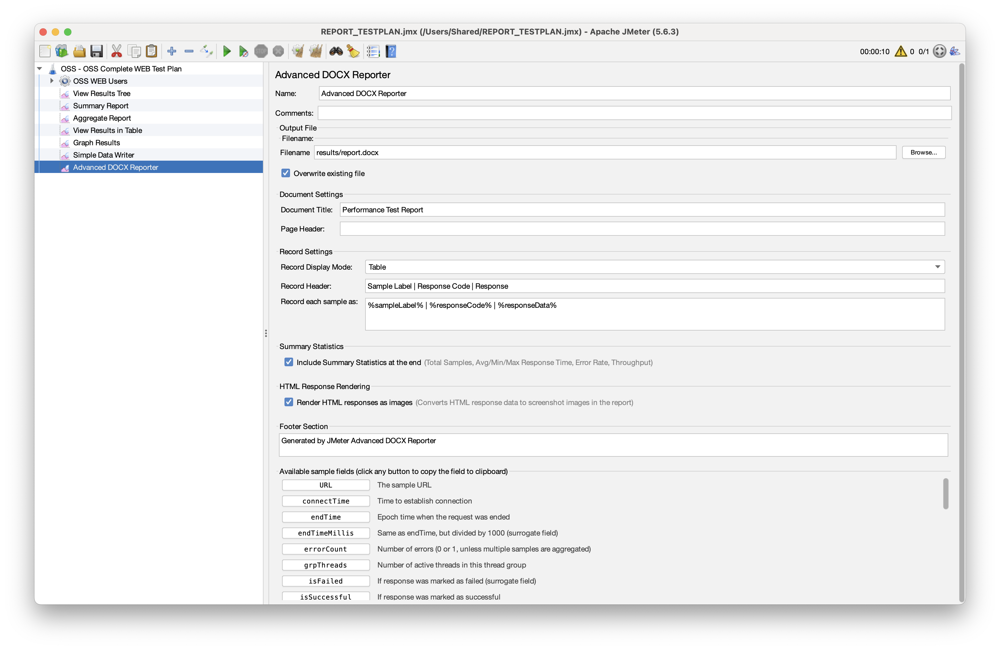
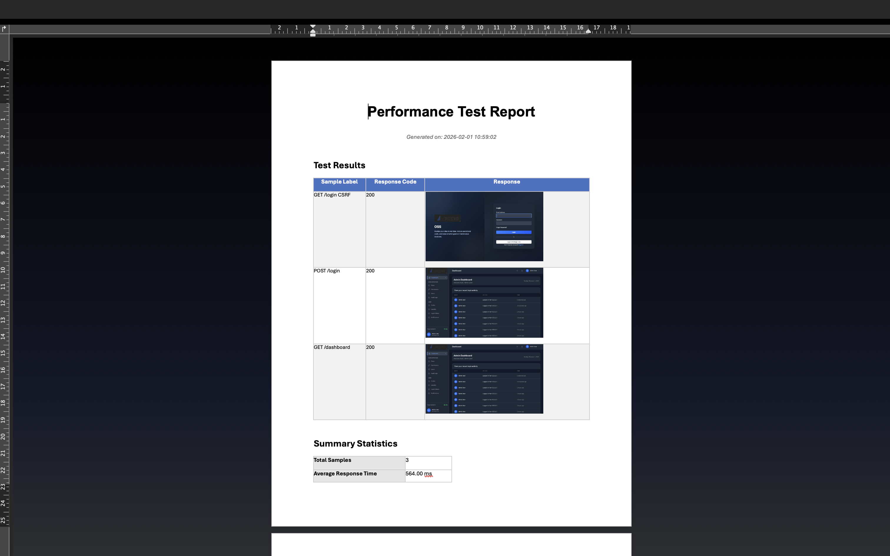

# Advanced DOCX Reporter for JMeter

A JMeter plugin that generates professional Word (DOCX) reports from your performance test results with customizable formatting and HTML response rendering.

Inspired by the [Flexible File Writer](https://jmeter-plugins.org/wiki/FlexibleFileWriter/) plugin, this reporter extends the concept of customizable output formats to generate Word documents with rich formatting, embedded images, and summary statistics.

## Features

- **DOCX Report Generation** - Automatically generates Word documents at the end of test execution
- **HTML to Image Rendering** - Captures HTML responses as images using Selenium WebDriver (supports JavaScript-heavy pages)
- **Customizable Templates** - Configure document title, headers, and record formats
- **Summary Statistics** - Include test summary with pass/fail counts, response times, and throughput
- **Multiple Display Modes** - Table view or detailed record view

## Screenshots

### JMeter Configuration


### Generated Report


## Requirements

- JMeter 5.6.3 or later
- Java 11 or later
- Google Chrome (for Selenium-based HTML rendering)

## Installation

1. Download the latest `advanced-docx-reporter-1.0.0.jar` from the releases
2. Copy the JAR file to your JMeter `lib/ext` directory
3. Restart JMeter

### Build from Source

```bash
# Clone the repository
git clone https://github.com/galihlasahido/jmeter-advanced-docx-reporter.git
cd jmeter-advanced-docx-reporter

# Build with Maven
mvn clean package

# Copy to JMeter
cp target/advanced-docx-reporter-1.0.0.jar /path/to/jmeter/lib/ext/
```

## Usage

1. Open JMeter and load your test plan
2. Add the listener: **Add > Listener > Advanced DOCX Reporter**
3. Configure the reporter settings:
   - **Output File**: Path for the generated DOCX report
   - **Document Title**: Title displayed in the report
   - **Render HTML as Image**: Enable to capture HTML responses as screenshots
4. Run your test
5. The DOCX report will be generated automatically when the test completes

### Important: Save Response Data

To include response data in your report (using `%responseData%` variable or HTML rendering), you must configure JMeter to save response data:

1. In your HTTP Request sampler or HTTP Request Defaults, ensure **Save Response Data** is enabled
2. Alternatively, add a **View Results Tree** listener and check **Save Response Data (XML)** in the Configure button
3. Or set in `jmeter.properties` or `user.properties`:
   ```properties
   jmeter.save.saveservice.response_data=true
   ```

> **Note:** Without saving response data, the `%responseData%` variable will be empty and HTML rendering will not work.

## Configuration Options

| Option | Description | Default |
|--------|-------------|---------|
| Output File | Path to save the DOCX report | `results/report.docx` |
| Document Title | Title of the report | `Performance Test Report` |
| Page Header | Header text for each page | Empty |
| Record Header | Header template for each sample | `${sampleLabel}` |
| Record Format | Format template for sample details | `Response: ${responseCode}` |
| Include Summary | Add summary statistics section | `true` |
| Render HTML as Image | Capture HTML responses as images | `false` |
| Display Mode | `table` or `detail` view | `table` |

## Template Variables

Use these variables in your templates:

| Variable | Description |
|----------|-------------|
| `${sampleLabel}` | Name of the sampler |
| `${responseCode}` | HTTP response code |
| `${responseMessage}` | HTTP response message |
| `${responseTime}` | Response time in milliseconds |
| `${responseData}` | Response body content |
| `${success}` | Pass/fail status |
| `${timestamp}` | Sample timestamp |
| `${threadName}` | Thread group name |
| `${bytes}` | Response size in bytes |
| `${url}` | Request URL |

## HTML Rendering

When **Render HTML as Image** is enabled, the plugin:

1. Detects HTML responses automatically
2. Renders HTML using headless Chrome via Selenium WebDriver
3. Captures a desktop-width (1280px) screenshot
4. Embeds the image in the DOCX report

This is useful for:
- Capturing login pages, dashboards, and web UIs
- Documenting visual appearance of responses
- JavaScript-rendered single-page applications

### Prerequisites for HTML Rendering

- Google Chrome browser installed
- ChromeDriver is managed automatically via WebDriverManager

## Project Structure

```
advance-report/
├── src/main/java/com/jmeter/plugin/docx/
│   ├── gui/
│   │   └── AdvancedDocxReporterGui.java    # JMeter GUI component
│   ├── reporter/
│   │   ├── AdvancedDocxReporter.java       # Main listener class
│   │   └── DocxReportGenerator.java        # DOCX generation logic
│   └── util/
│       ├── HtmlToImageRenderer.java        # HTML to image conversion
│       ├── SeleniumHtmlRenderer.java       # Selenium-based rendering
│       └── SummaryStatistics.java          # Test statistics
├── pom.xml
├── build-and-deploy.sh
└── README.md
```

## Dependencies

- Apache POI 5.2.5 - DOCX generation
- Selenium WebDriver 4.16.1 - Browser automation for HTML rendering
- WebDriverManager 5.6.2 - Automatic ChromeDriver management

## Troubleshooting

### HTML images are blank or not rendering
- Ensure Google Chrome is installed
- Check that the page doesn't require authentication
- Verify ChromeDriver can be downloaded (internet connection required on first run)

### Report not generated
- Check JMeter logs for errors
- Verify the output directory exists and is writable
- Ensure the test collected at least one sample

### ChromeDriver version mismatch
- WebDriverManager automatically downloads the correct ChromeDriver version
- If issues persist, try clearing the cache: `rm -rf ~/.cache/selenium`

## License

MIT License

## Contributing

1. Fork the repository
2. Create a feature branch
3. Make your changes
4. Submit a pull request

## Author

Created for JMeter performance testing and reporting automation.
